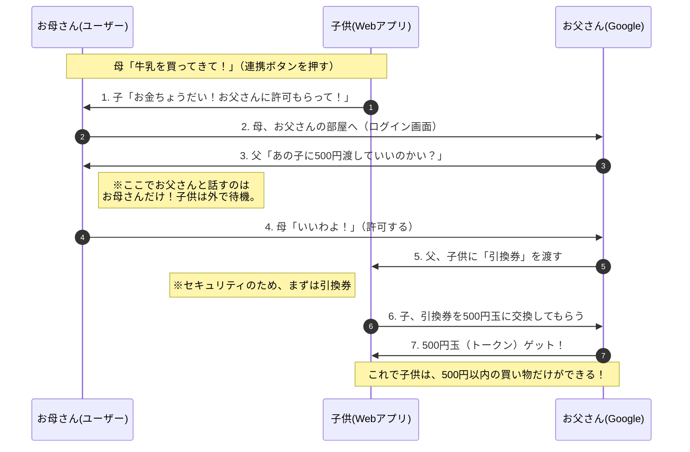

### はじめに

スマホを使っていると、「Googleでログイン」 や 「LINEで連携」 というボタンをよく見かけますよね。
これ、実は「はじめてのおつかい」に例えると、すごく大事なことをしているんです。

もしあなたが、子供に「コンビニで牛乳買ってきて！」と頼むとき、次のどちらの方法でお金を渡しますか？

1.  クレジットカードも入った「おサイフ」をそのまま渡す
2.  必要な分の「小銭（500円玉）」だけを渡す

絶対に 2番（小銭だけ） ですよね。
1番だと、帰り道でおサイフを落としたり、うっかりお菓子を買いすぎたりしたら大変です。

実は、この「おサイフ（全権限）」を守りながら、「小銭（必要な権限）」だけを渡す仕組みこそが、OAuth 2.0（オーオース 2.0） なのです。

## 1\. 危険なおつかい（OAuthがない世界）

OAuthがない世界では、アプリ（子供）にお願いする方法が一つしかありません。
それは、お母さんの全財産が入った「おサイフ（IDとパスワード）」をそのまま渡すことです。

:::note alert
😱 おサイフ（ID/PASS）ごと渡すリスク

  * 紛失: 子供がおサイフを公園に忘れてきたら、全財産がなくなります。
  * 使い込み: 「牛乳だけ」と頼んだのに、高額なオモチャを買ってしまうかもしれません。
  * プライバシー: おサイフに入っている免許証や診察券まで見られてしまいます。
    :::

「牛乳を買ってきてほしいだけなのに、おサイフごと渡すのは怖すぎる！」
そう思いますよね。

## 2\. 安全なおつかい（OAuthがある世界）

そこで、インターネットの世界では「おサイフを渡さないルール」を作りました。

1.  お母さん（あなた）は、子供におサイフを渡しません。
2.  代わりに、おサイフから「牛乳専用の500円玉（アクセストークン）」を取り出します。
3.  子供には、その500円玉だけを渡します。

これならどうでしょう？
もし子供が500円玉を落としても、被害は500円で済みます。高いゲームソフトを買われる心配もありません。

この「おサイフ（親の全権限）を守りながら、小銭（子供用の限定権限）だけを渡す仕組み」が、OAuth 2.0 なのです。

## 3\. 登場人物を整理しよう

この「おつかい」の登場人物を、実際のIT用語と照らし合わせてみましょう。

| 専門用語 | この記事での呼び名 | おつかいの例え | 役割 |
|:---:|:---:|:---:|:---|
| Resource Owner | ユーザー | お母さん（あなた） | お金（データ）の持ち主。 |
| Client | Webアプリ | 子供 | おつかいに行く人。 |
| Authorization Server | 認可サーバー | お父さん（金庫番） | おサイフを管理し、お母さんの許可で小銭を出す人。 |
| Access Token | アクセストークン | 500円玉 | 牛乳を買うためだけの、特別な小銭。 |

Webアプリ（子供）は、あなたのおサイフの中身（パスワード）を知りません。持っているのは、お母さんが許可して渡した500円玉（トークン）だけです。

## 4\. 全体の流れ（図解）

では、実際にアプリ（子供）が、Google（家のお金）を使ってデータ（牛乳）を取りに行く流れを見てみましょう。
ここでの「Google」は、お金を管理している「お父さん」だと想像してください。

### ポイント解説

1.  パスワードはお父さんにしか教えない
    暗証番号やパスワードを使うのは、信頼できる「お父さん（Google）」に対してだけです。いくら可愛い子供（アプリ）でも、大事な暗証番号は教えません。
2.  500円玉には「ルール」がある
    この500円玉（トークン）には、「牛乳代のみ」「1時間以内に帰ってくること」といったルールがついています。だから、子供が勝手に遠くへ行ったりはできません。

## 5\. よくある間違い：「認証」と「認可」

最後に、よく似ている2つの言葉の違いを、この親子でスッキリさせましょう。

  * 認証 (Authentication): 「あなたは誰？」
      * お父さんがドア越しに「お母さんかい？」と声を聞いて確認すること。（本人確認）
  * 認可 (Authorization): 「何をしていい？」
      * お父さんが子供に「お買い物をしていいよ」と500円玉を渡すこと。（権限を与える）

OAuth 2.0は、名前の通りAuthorization（認可＝お金を渡すこと）の仕組みです。
「誰か」を確認するだけでなく、「何ができる権限を与えるか」をコントロールしているのがポイントです。

## まとめ

  * OAuthがない世界 ＝ おサイフごと子供に渡す（落としたら大変！😱）
  * OAuthがある世界 ＝ 500円玉だけ子供に渡す（安心！😊）
  * アクセストークン ＝ 500円玉（用途が限定された使い捨てのお金）

私たちが安心してWebサービスを使えるのは、裏側でちゃんとお母さんがおサイフを守り、子供には小銭だけを持たせているからなのです。